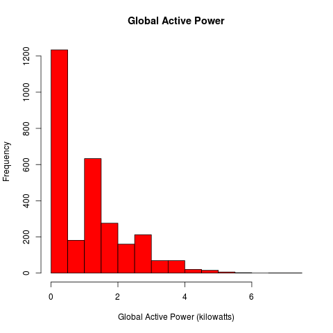
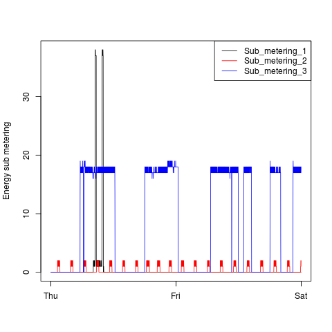

# Exploratory Data Analysis Assignment: Course Project 1

## Introduction

The goal for this project is to create exploratory graphs from the provided
dataset.

For assignement instructions see [INSTRUCTIONS.md](INSTRUCTIONS.md)

## Dataset

This assignment uses data from
the <a href="http://archive.ics.uci.edu/ml/">UC Irvine Machine
Learning Repository</a>, a popular repository for machine learning
datasets. In particular, we will be using the "Individual household
electric power consumption Data Set" which is made available on
the course web site:

* <b>Dataset</b>: <a href="https://d396qusza40orc.cloudfront.net/exdata%2Fdata%2Fhousehold_power_consumption.zip">Electric power consumption</a> [20Mb]

## Usage

For each plot there is a script `plot1.R`, `plot2.R`, `plot3.R` and `plot4.R`.
To re-create the plots the usage similar for aech script:

    source("plot1.R")

If the dataset is not downloaded the scripts will download it automatically and
then create the png file.

## Results

### Plot 1

 

### Plot 2

 

### Plot 3

 

### Plot 4

 

